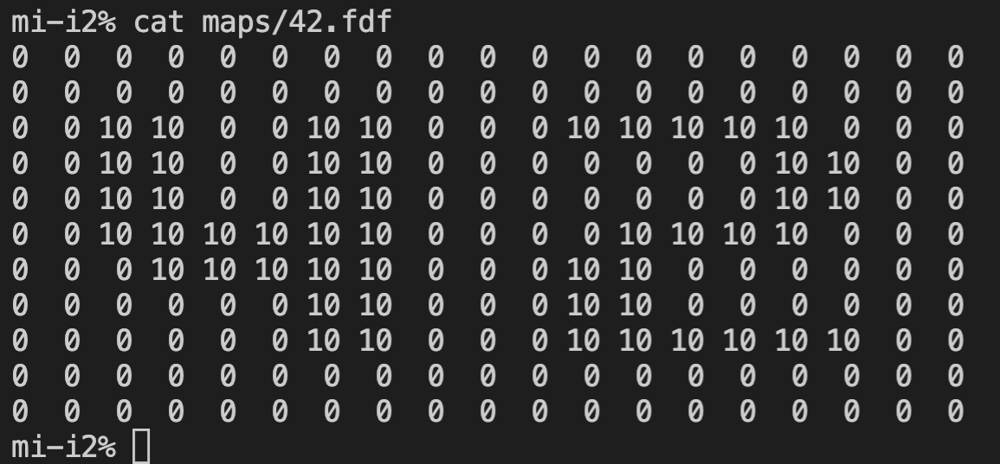
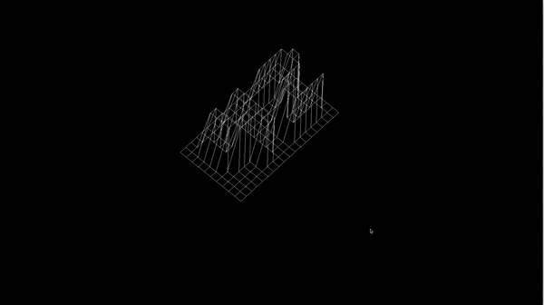

# Fdf

Графический проект, целью которого было отрисовать каркас по заданным в виде матрицы координатам точек. Из матрицы путем перспективного преобразования получаются координаты точек на экране. Также при помощи помощи матриц поворота была реализована возможность вращать каркас по 3 осям.

Graphic project: a simple wireframe model representation of a 3D landscape. The model in isometric projection is build by linking various points (x, y, z) thanks to line segments (edges). Model can be zoomed in/out, translated and rotated due x, y, z axis. All this rendering is based on matrix multiplications and linear transformations. 

## Example
---
**input**

 

**output**

 

## How to run
---
### **compile**
make -C src bonus
### **run**
./fdf maps/{choose map}

Translate  
>W  
ASD

Rotate  
>UIO  
JKL

Zoom in/out  
>Q/E

Another projection 
>C

Exit  
>Esc

### **clean**
make -C src fclean

